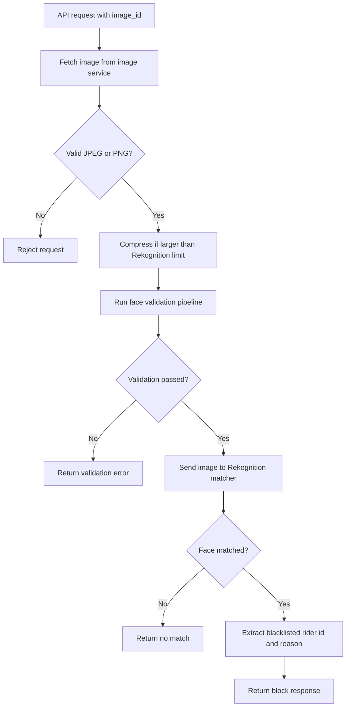
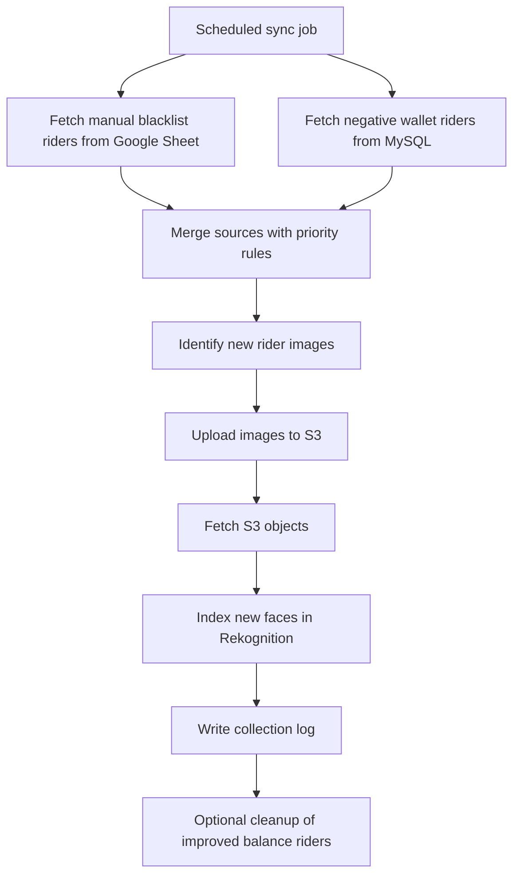
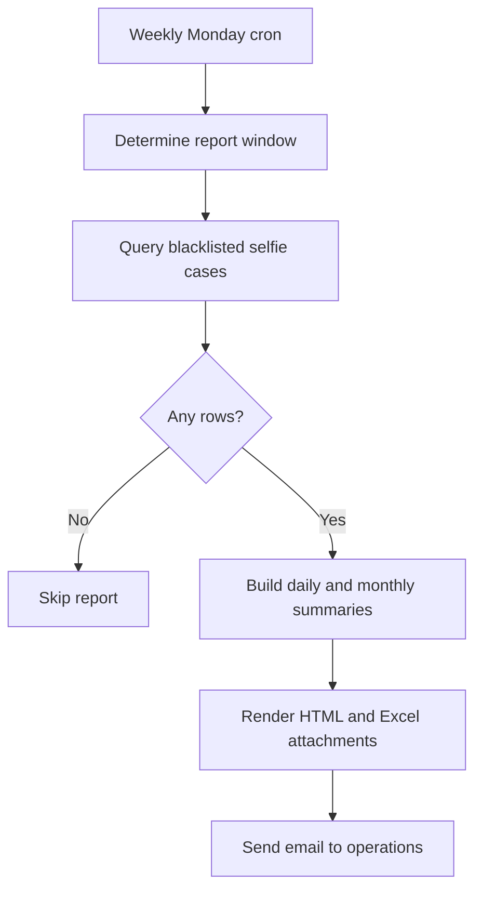

# Blacklisting Face Verification - High Level Process and Flow

Use this document as a prompt for slide generation. It summarizes the blacklisting system at a high level, focusing on roles, data flow, validation, APIs, pipeline stages, and the techniques used to improve retrieval accuracy.

## 1. Purpose

The blacklisting system identifies riders whose face matches a blacklist source and blocks them from sensitive workflows. It combines image quality validation, face matching, collection sync, and reporting so the operational team can maintain a current blacklist with low false positives.

## 2. Roles Catered

- Rider: uploads or triggers a selfie-based verification request.
- Operations team: maintains manual blacklist sources and reviews monthly reporting.
- Mechanic / field user context: appears in mismatch or missing UID workflow history.
- Backend API: validates images and returns the match decision.
- Sync cron: keeps the Rekognition collection aligned with business sources.
- Analytics/reporting cron: produces monthly summary outputs for the operations team.

## 3. Data Types Catered

- Live data: incoming rider selfie images during verification.
- Static data: images already stored in the image service or S3, and the indexed Rekognition collection.
- Operational source data: Google Sheet blacklist entries and MySQL business data.
- Audit data: collection logs, validation history, and report outputs.

## 4. Core Sources and Ingestion

- Rider image is fetched from the image base URL using the provided image ID.
- Blacklist sources are merged from MySQL and the manually maintained Google Sheet.
- Images are uploaded to S3 before Rekognition indexing.
- Rekognition collection name and cloud credentials are resolved from secrets.
- Monthly report data is fetched from MySQL using parameterised SQL queries.

## 5. Main System Flows

### 5.1 Verification Flow

### 5.2 Collection Sync Flow

### 5.3 Monthly Reporting Flow

## 6. Validation and Accuracy Controls

The retrieval accuracy is improved before Rekognition matching is attempted.

- Face must be detected by the validator pipeline.
- Only one face is allowed in the image.
- Face must be frontal enough to avoid side-angle matches.
- Face must be complete and not cut off by the frame.
- Occlusion checks filter out hands or covered facial regions.
- Blur checks reject low-quality selfies.
- Eye-open checks reduce false acceptance from closed-eye images.
- Light quality and face size checks prevent weak or unusable matches.
- Images larger than the Rekognition byte limit are compressed before inference.

## 7. Models Used

- AWS Rekognition collection: the main face search and verification engine.
- MediaPipe Face Landmarker: frontal face, landmark, and multi-face detection.
- MediaPipe Face Detector: stronger scene-level face counting.
- MediaPipe Hand Landmarker: detects hands covering the face.
- Landmark-based completeness and occlusion logic: filters cropped and blocked selfies.

## 8. API Sets

- Face recognition API: `/check/blacklisted`
- Startup initialization: loads the matcher into app state on server boot.
- Existing backend authentication and user dependencies are reused for access control.

## 9. User Flow

1. User submits a selfie or a rider image reference.
2. Backend fetches the image from the storage service.
3. Image is normalized and compressed if required.
4. Validation pipeline rejects weak inputs early.
5. Rekognition searches the blacklist collection.
6. System returns either a block decision, a no-match response, or a validation failure.
7. If matched, the response includes rider identity hints, reason, and similarity metadata.

## 10. Tech Stack and Modules

- FastAPI backend for the request layer.
- Python async utilities and thread offloading for inference work.
- AWS Rekognition for face search and collection indexing.
- AWS S3 for face image storage.
- MySQL for blacklist source data and audit/report queries.
- Google Sheets for manual blacklist maintenance.
- APScheduler for scheduled sync and reporting jobs.
- Pandas for source merging, filtering, and report shaping.
- OpenCV, PIL, and NumPy for image normalization and validation.
- MediaPipe for landmark, face, and hand analysis.
- Redis for shared caching and runtime support.

## 11. Major Modules

- `backend/api/api_endpoints.py`: general API routes.
- `backend/api/login.py`: authentication and login flow.
- `projects/blacklisting/api.py`: blacklisting face verification endpoint.
- `projects/blacklisting/rekognitionmatcher.py`: image validation plus Rekognition search.
- `projects/blacklisting/rekognitionsyncer.py`: syncs blacklist sources into S3 and Rekognition.
- `projects/blacklisting/setup.py`: loads matcher into app state.
- `projects/blacklisting/Cron/Blacklisting_report.py`: monthly reporting cron.
- `projects/blacklisting/face_validator/pipeline.py`: orchestrates validation stages.
- `projects/blacklisting/face_validator/validators/`: frontal, completeness, and occlusion checks.

## 12. Suggested Slide Narrative

- Slide 1: Why blacklisting exists and which roles use it.
- Slide 2: Inputs, data sources, and live versus static data.
- Slide 3: Request flow from API to validation to Rekognition match.
- Slide 4: Sync and cleanup flow for keeping the collection current.
- Slide 5: Accuracy gates that reduce false matches and bad inputs.
- Slide 6: Reporting and ops visibility.
- Slide 7: Tech stack and module map.

## 13. High Level Summary

This system is a multi-stage face safety pipeline: it ingests rider images, validates image quality, matches against an indexed blacklist collection, keeps the collection in sync with live business sources, and reports the outcome back to operations. The combination of pre-filtering, multi-model validation, source merging, and scheduled maintenance is what keeps retrieval accurate and operationally usable.
