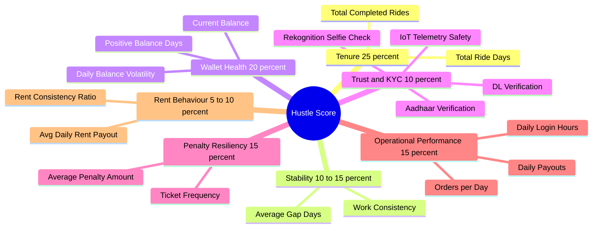

# Slide Deck: AI-Powered Credit Scoring System (Zybil / Hustle Score)
*Designed for Investors & Strategic Partners*

---

## Slide 1: Title Slide
### **Unlocking Financial Inclusion for India's Gig Economy**
*The Zypp Electric AI Credit Scoring Engine (Zybil / Hustle Score)*

* **Subtitle:** Leveraging EV fleet telemetry, transactional wallet health, and operational performance to build the credit bureau of the future for gig workers.
* **Presented by:** Zypp Electric AI Team
* **Target Audience:** Venture Capitalists, Strategic Investors, and FinTech Partners

---

## Slide 2: The Problem
### **The Credit Gap in the Gig Workforce**
*Traditional credit scoring fails the 15 million+ gig workers in India.*

* **The Credit Bureau Blindspot:** Over 90% of gig workers (delivery riders) are unbanked, underbanked, or have thin credit files (low/no CIBIL score).
* **High Operational Risks:** EV leasing platforms face collection defaults, vehicle abuse, rapid churn, and vehicle recovery challenges.
* **Misaligned Underwriting:** Banks assess credit based on stable salary slips; gig workers have highly volatile daily payouts across multiple platforms (Zomato, Blinkit, Swiggy, etc.).
* **The Consequences:** Gig riders struggle to purchase vehicles or access capital, while fleet operators suffer from underutilized assets and high collections costs.

---

## Slide 3: The Opportunity
### **Zypp Electric’s Unique Data Advantage**
*We possess proprietary data streams that traditional credit bureaus cannot access.*

* **Continuous Operational Telemetry:** We capture every ride, speed violation, and route.
* **Closed-loop Wallet Transaction History:** All rent payments, earnings deductions, and deposits flow through the Zypp Wallet.
* **Real-time Multi-Merchant Performance:** Payout details, active login hours, and order volumes across India’s leading delivery platforms.
* **Biometric Identity Verification:** AI-driven selfie audits and Rekognition face ID history prevent account sharing and identity fraud.

---

## Slide 4: The Solution
### **Introducing the Zybil / Hustle Score Engine**
*A 300–900 scale proprietary credit score tailored specifically for gig workers.*

```
      [300 - 419]       [420 - 539]       [540 - 659]       [660 - 779]       [780 - 900]
     ┌─────────────┐   ┌─────────────┐   ┌─────────────┐   ┌─────────────┐   ┌─────────────┐
     │    RED      │   │   NORMAL    │   │   BRONZE    │   │    GOLD     │   │   DIAMOND   │
     │  High Risk  │   │  Mid-High   │   │   Average   │   │  Low Risk   │   │  Premium    │
     └─────────────┘   └─────────────┘   └─────────────┘   └─────────────┘   └─────────────┘
```

* **Core Innovation:** Maps complex multi-dimensional operational, financial, and behavioral telemetry to a standard, easy-to-read credit grade.
* **Dual Scoring Engine:**
  1. **Batch Pipeline (Cron):** Daily bulk scoring of the entire active fleet for risk analytics and operations management.
  2. **Real-Time API:** On-demand score generation within seconds to instantly qualify riders for bike upgrades, loans, or incentive schemes.

---

## Slide 5: Core Architectural Philosophy
### **Fair, Dynamic, and Segment-Aware Design**
*How the algorithm ensures accuracy across diverse markets and operational profiles.*

* **City Cohort Isolation:** Percentile benchmarks are computed *within* specific city boundaries. A rider in Tier-2 Jaipur is not compared against Tier-1 Delhi volumes, ensuring geographical fairness.
* **Rider-Type Aware Paths:**
  * **B2C (Renters):** Evaluated strictly on wallet health, rent consistency, and trust dimensions.
  * **B2B / Merchant Delivery:** Evaluated also on merchant payout metrics, productivity, and order efficiency.
* **Multi-Merchant Aggregation:** Scores multiple delivery platforms simultaneously. A rider's performance is aggregated using a **tenure-weighted average** (e.g., weighing 300 days on Zomato higher than 5 days on Blinkit).

---

## Slide 6: The 7 Scoring Dimensions
### **How We Measure Creditworthiness**
*A holistic model combining operational stability, financial health, and identity trust.*



---

## Slide 7: Telemetry-Driven Safety Scoring
### **IoT Telematics & Riding Behaviour Integration**
*Leveraging vehicle IoT devices to assess asset risk and rider safety.*

* **Real-time Edge Telemetry:** Connected EV bikes feed accelerometer, GPS, and speed sensor data directly to our systems.
* **Harsh Riding Profiling:** The engine counts unsafe events (harsh acceleration, hard braking, overspeeding) per ride.
* **Safety to Score Mapping:**
  * **Safe (100 pts) / Low Risk (75 pts):** Qualifies riders for higher tiers and lower deposit thresholds.
  * **Medium Risk (40 pts) / High Risk (10 pts):** Signals asset abuse, raising lease costs and triggering safety training.
* **Dynamic Blending:** Behaviour telemetry is blended directly into the **Trust Score** dimension at a 20% weight.

---

## Slide 8: Technology & Scalable Data Architecture
### **Designed for High Availability and Low Latency**

```
     [ Data Sources ]             [ Daily Batch Processing ]           [ API / Presentation ]
 ┌──────────────────────┐        ┌──────────────────────────┐        ┌────────────────────────┐
 │   MySQL Databases    │───────>│   OverallBaseFeatures    │───────>│  FastAPI Endpoints     │
 │  (Rides, Payments)   │        │   (Parallel Collection)  │        │  (Redis Cached Lookup) │
 └──────────────────────┘        └────────────┬─────────────┘        └───────────▲────────────┘
 ┌──────────────────────┐                     │                                  │
 │   MongoDB Telemetry  │───────>             ▼                                  │
 │   (IoT Safety Data)  │        ┌──────────────────────────┐        ┌───────────┴────────────┐
 └──────────────────────┘        │    Percentile Recalc     │───────>│   MySQL Analytics DB   │
                                 │    (*.parquet files)     │        │  (Delta Sync Updates)  │
                                 └────────────┬─────────────┘        └────────────────────────┘
                                              ▼
                                 ┌──────────────────────────┐
                                 │       BatchScorer        │
                                 └──────────────────────────┘
```

* **Delta Sync Persistence:** To minimize database writes, the daily pipeline classifies updates (Active↔Inactive) and applies delta updates to the MySQL database.
* **High-Speed Caching:** Employs a multi-tier Redis cache strategy (from 5-minute paginated lists to 1-hour parquet lookups) with automated cron-driven cache invalidation.

---

## Slide 9: Business & Financial Impact
### **Proven Operational Excellence & Monetization Vectors**

* **Collection Default Reduction:** By flagging negative wallet and rent trends early, operational teams can act before arrears accumulate.
* **Asset Lifecycle Optimization:** Blending IoT safety scores reduces vehicle wear-and-tear, maintenance expenses, and accident-related downtime.
* **Rider Retention & Loyalty:** Diamond and Gold tier riders get priority upgrades, zero-deposit terms, and higher-paying merchant contracts, reducing fleet churn.
* **FinTech & Credit Monetization:** 
  * Open API integrations allow third-party lenders and credit unions to offer micro-loans, health insurance, and personal financing directly to riders.
  * Zypp serves as the verification and underwriting gateway.

---

## Slide 10: The Road Ahead
### **The Future of Gig-Work Underwriting**

* **Predictive Churn & Trajectory Modeling:** Implementing machine learning models to analyze the velocity of score changes (detecting early signs of decline/improvement).
* **Machine Learning Weight Tuning:** Moving from fixed rules to dynamically optimized regression models using actual collection/churn historical data.
* **FinTech Partnerships:** Launching co-branded credit cards and micro-credit products with leading digital banking partners in India.
* **Zero-Trust KYC Automation:** Scaling face recognition syncs to completely automate identity security and eliminate fleet sharing.
