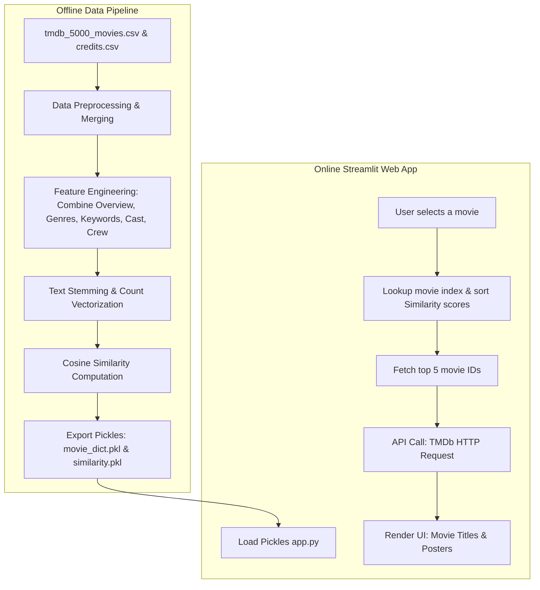

# 🎬 MOVIERecommendator - Project Overview

An up-to-date, end-to-end documentation of the **Movie Recommendator** project, describing its architecture, data pipeline, technology stack, components, and execution workflow.

---

## 📌 Project Summary
**MOVIERecommendator** is a content-based movie recommendation web application. Based on a user's selected movie, it calculates similarity scores across a dataset of ~5,000 films and recommends the top 5 most similar movies. It also queries **The Movie Database (TMDb) API** in real-time to fetch and display the corresponding movie posters.

---

## 🛠 Technology Stack

### Core Technologies & Libraries
- **Python**: Core programming language.
- **Streamlit (v1.42.2)**: Lightweight framework used to build and serve the interactive web UI.
- **Pandas (v2.2.3)** & **NumPy (v2.2.1)**: Used for data parsing, structured cleaning, and matrix manipulations.
- **Scikit-Learn (v1.6.0)**: Used for text vectorization (`CountVectorizer`) and calculating cosine similarity.
- **NLTK (Natural Language Toolkit)**: Used for stemming/text preprocessing (specifically `PorterStemmer`).
- **Requests (v2.32.3)**: Handles HTTP requests to the external TMDb API for fetching poster URLs.
- **Pickle**: Standard Python object serialization for storing the processed dataframes and similarity matrices.

---

## 📐 Architecture & Components

The application is structured into two main phases: **Model Development (Offline Pipeline)** and **Web App Interface (Online System)**.



### 1. Data Pipeline & Training (`Movie Recommendator.ipynb`)
- **Dataset**: TMDB 5,000 Movies and Credits datasets.
- **Data Preprocessing**:
  - Drops unnecessary features and merges datasets on the `title` column.
  - Keeps relevant fields: `movie_id`, `title`, `overview`, `genres`, `keywords`, `cast`, `crew`.
  - Parses JSON strings to extract genre tags, keywords, top 3 cast members, and the director's name.
  - Removes whitespace from parsed words (e.g., `"Johnny Depp"` becomes `"JohnnyDepp"`) to prevent tag collisions.
- **Feature Engineering & NLP**:
  - Combines `overview`, `genres`, `keywords`, `cast`, and `crew` into a single text block called `tags`.
  - Tokenizes and stems the tags using the `PorterStemmer` to unify variations of words (e.g., `"loving"`, `"loved"`, `"love"` $\rightarrow$ `"love"`).
  - Converts text tags to numeric vectors using `CountVectorizer` (with `max_features=5000` and English stop words removed).
- **Modeling**:
  - Computes a $4806 \times 4806$ **Cosine Similarity** matrix representing the angular distance between all movie vectors.
- **Serialization Outputs**:
  - `movies.pkl` / `movie_dict.pkl`: Exported dictionary of processed movies.
  - `similarity.pkl`: Compressed Cosine Similarity matrix (approx. 185 MB).

### 2. Frontend / Application Engine (`app.py`)
- **State Initialization**: Loads the serialized dataframe (`movie_dict.pkl`) and similarity matrix (`similarity.pkl`).
- **Core Recommendation Logic (`recommend(movie)`)**:
  - Locates the index of the selected movie.
  - Retrieves its corresponding similarity vector from `similarity.pkl`.
  - Pairs each score with its index, sorts them descending, and extracts the top 5 matches (excluding itself).
- **External Integration (`fetch_poster(movie_id)`)**:
  - Queries `https://api.themoviedb.org/3/movie/{movie_id}` using a TMDb API key.
  - Gracefully handles rate limits, timeout exceptions, network disconnects, and invalid IDs, returning a fallback placeholder image if an error occurs.
- **Layout & Rendering**:
  - Uses Streamlit's selectbox component for search input.
  - Displays recommendation results in a clean 5-column responsive grid layout with text titles and poster images.

### 3. Deployment Configuration
- **`setup.sh`**: Creates Streamlit's configuration directory and dynamically writes `~/.streamlit/config.toml` containing server specs, dynamic ports, and CORS configurations.
- **`procfile`**: Configures the platform web process entry point to run `setup.sh` followed by launching the Streamlit app:
  ```yaml
  web: sh setup.sh && streamlit run app.py
  ```

---

## 📂 Project Directory Structure

```bash
MOVIERecommendator/
├── Movie Recommendator.ipynb  # Jupyter Notebook containing the training & cleaning pipeline
├── app.py                    # Streamlit frontend & recommendation engine
├── movie_dict.pkl            # Processed movie metadata dictionary
├── movies.pkl                # Pickled movie DataFrame (alternative format)
├── similarity.pkl            # Pickled Cosine Similarity matrix (~185MB)
├── requirements.txt          # Python packages and version requirements
├── setup.sh                  # Shell script configuring Streamlit environment
└── procfile                  # Web server launch script for hosting services
```

---

## 🚀 How to Run Locally

1. **Clone the Repository**:
   ```bash
   git clone <repository-url>
   cd MOVIERecommendator
   ```

2. **Set up a Virtual Environment**:
   ```bash
   python3 -m venv venv
   source venv/bin/activate
   ```

3. **Install Dependencies**:
   ```bash
   pip install -r requirements.txt
   ```

4. **Run the Streamlit Application**:
   ```bash
   streamlit run app.py
   ```
