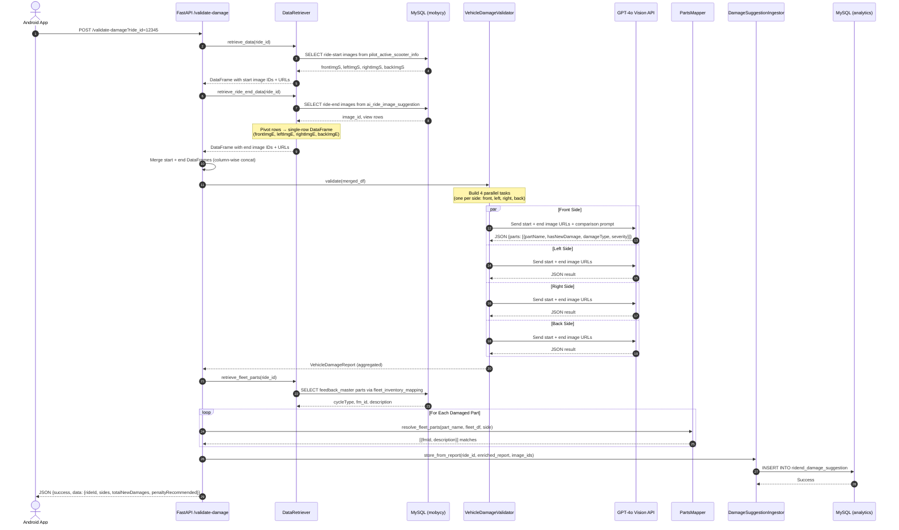
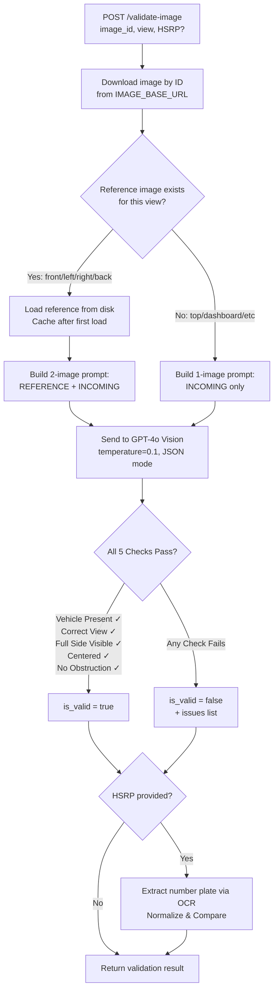
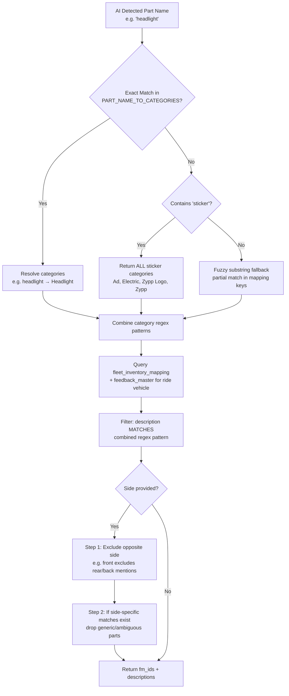
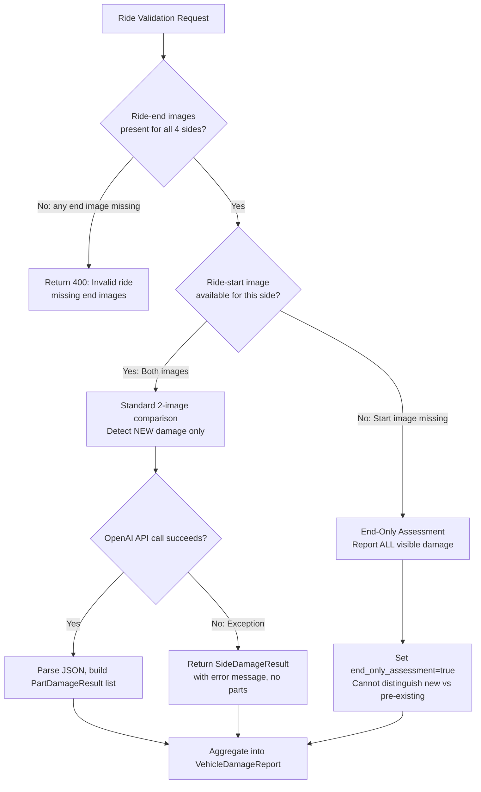
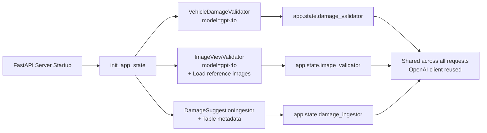

# AI Vehicle Validation — High-Level Processes and Flows

This document outlines the architecture, data flows, APIs, and key mechanisms of **AI Vehicle Validation** (ZYPPAI-172), Zypp Electric's AI-powered damage detection and image quality system for ride-end vehicle assessments. It is structured to serve as a comprehensive prompt for generating slide decks, complete with visual suggestions and flowcharts.


---

## Slide 1: Executive Summary & Overview
**Visual Suggestion:** A split-screen layout. On the left: A grid of four scooter photos (front, left, right, back) with AI bounding boxes highlighting detected damage. On the right: A high-level schematic showing images flowing into OpenAI Vision API and returning structured damage reports.

*   **What is AI Vehicle Validation?** An automated, real-time damage detection system that uses OpenAI's GPT-4o Vision API to compare ride-start and ride-end scooter images, detect new aesthetic damage, validate image quality, and verify number plates.
*   **Core Capabilities:**
    *   **Damage Detection:** Compares before/after image pairs for each vehicle side (front, left, right, back) to identify new scratches, dents, cracks, scuffs, missing parts, and breakage introduced during a ride.
    *   **Image Quality Validation:** Verifies that uploaded images show the correct vehicle view, are properly centered, fully visible, unobstructed, and match against reference example images.
    *   **Number Plate Verification:** Extracts vehicle registration numbers via OCR and cross-matches against the HSRP on file.
    *   **Fleet Parts Mapping:** Maps AI-detected damaged parts to fleet-specific inventory items using regex-based category resolution, enabling automatic penalty suggestions.
    *   **Analytics Persistence:** Stores all damage suggestions in the analytics database for downstream penalty processing and operational dashboards.
*   **The Goal:** Eliminate subjective manual QC checks, reduce penalty disputes, accelerate ride-end processing, and ensure consistent damage assessments across all cities.

---

## Slide 2: Validation Modules & Responsibilities
**Visual Suggestion:** A matrix table or a set of four card widgets, each representing a distinct validation module with icons and feature checklists.

The system is decomposed into four purpose-built validator classes, each with a single responsibility:

| Module | Class | Key Responsibility | Input | Output |
| :--- | :--- | :--- | :--- | :--- |
| **Damage Validator** | `VehicleDamageValidator` | Compares ride-start vs ride-end images to detect NEW aesthetic damage per vehicle side. | DataFrame with image URLs for all 4 sides (start + end). | `VehicleDamageReport` with per-side, per-part damage verdicts. |
| **Image View Validator** | `ImageViewValidator` | Validates whether a single image matches the expected view (front/back/left/right) using reference-based comparison. | Raw image bytes + expected view name. | `ImageValidationResult` with boolean checks (vehicle present, correct view, centered, full side visible, no obstruction). |
| **Number Plate Validator** | `NumberPlateValidator` | Extracts number plate text via OCR and compares against the provided HSRP. | Raw image bytes + DL/HSRP number string. | `NumberPlateMatchResult` with extracted plate text and match boolean. |
| **Parts Mapper** | `resolve_fleet_parts()` | Maps AI-detected part names to fleet-specific `feedback_master` inventory IDs using regex. | Part name string + fleet parts DataFrame + vehicle side. | List of `{fmId, description}` dicts for penalty processing. |

---

## Slide 3: Tech Stack & System Modules
**Visual Suggestion:** A layered architecture diagram showing the relationship between the Android app, FastAPI gateway, OpenAI Vision, MySQL databases, and the analytics pipeline.

```
       [ Android Client App ]
                │ (REST API calls)
       [ FastAPI Gateway (Rate Limited) ]
                │
       ┌────────┴─────────┐
       │                  │
 [ /validate-damage ]  [ /validate-image ]
       │                  │
 [ VehicleDamageValidator ]  [ ImageViewValidator ]
       │                  │
  ┌────┴────┐         ┌───┴───┐
  │         │         │       │
[OpenAI   [Data     [OpenAI  [Reference
 GPT-4o   Retriever] GPT-4o   Image Cache]
 Vision]      │      Vision]
              │
       [ MySQL Databases ]
       (mobycy, analytics)
              │
       [ DamageSuggestionIngestor ]
       (analytics.ridend_damage_suggestion)
```

*   **Vision AI Engine:**
    *   **OpenAI GPT-4o Vision API:** Performs all image understanding — damage comparison, view validation, and number plate OCR. Uses `response_format=json_object` for structured output, `temperature=0.1` for deterministic results.
*   **Application Layer:**
    *   **FastAPI:** Exposes rate-limited REST endpoints (`100/min` for damage, `200/min` for image validation).
    *   **SQLAlchemy (Async):** Executes read queries against operational MySQL and write queries to the analytics database.
*   **Image Processing:**
    *   **Pillow (PIL):** Pre-processes images — resizes to max 1024px, converts color modes, JPEG-encodes at quality 85 for optimal API cost/quality tradeoff.
    *   **Base64 Encoding:** Reference images are loaded from disk, encoded once, and cached in-memory per validator instance.
*   **Data Persistence:**
    *   **MySQL (`mobycy` schema):** Source for ride images (`pilot_active_scooter_info`, `ai_ride_image_suggestion`), fleet inventory (`fleet_inventory_mapping`, `feedback_master`), and ride metadata.
    *   **MySQL (`analytics` schema):** Target table `ridend_damage_suggestion` stores validated damage records with fm_id mappings.

---

## Slide 4: End-to-End Damage Validation Flow
**Visual Suggestion:** A horizontal sequence diagram tracking a damage validation request from API call to analytics storage.



---

## Slide 5: Image View Validation Flow
**Visual Suggestion:** A flowchart showing the dual-path validation logic — with reference image vs. without reference image — converging into a unified quality check.



### 5 Quality Checks Performed:
1.  **Vehicle Present:** Is an electric scooter clearly visible (not blank, blurry, or irrelevant)?
2.  **Correct View:** Does the image match the expected view (front/back/left/right)?
3.  **Full Side Visible:** Is the entire side captured (no excessive zoom or cropping)?
4.  **Centered:** Is the scooter reasonably centered in the frame?
5.  **No Obstruction:** Is the scooter body free from covering objects? *(Note: People/hands nearby are explicitly allowed — only objects ON the scooter body cause failure.)*

---

## Slide 6: Data Sources & Schema Architecture
**Visual Suggestion:** Two columns with distinct card colors. Left: "Read Sources (mobycy)" (Database grid icon). Right: "Write Target (analytics)" (Analytics dashboard icon).

The system reads from operational tables and writes to an analytics table:

### Read Sources (mobycy schema)

| Table | Purpose | Key Columns |
| :--- | :--- | :--- |
| `pilot_active_scooter_info` | Ride-start image IDs per side. | `rideId`, `frontImgS`, `backImgS`, `leftImgS`, `rightImgS` |
| `ai_ride_image_suggestion` | Ride-end image IDs per view (pivoted to single row). | `ride_id`, `image_id`, `view`, `type='RIDE_END'` |
| `rides` | Enriches with userId and cycleId for fleet lookup. | `rideId`, `userId`, `cycleId` |
| `cycles` | Maps cycleId → cycleType for fleet part matching. | `cycleId`, `cycleType` |
| `fleet_inventory_mapping` | Maps fleet types to feedback master parts (active only). | `fleet_type`, `feedback_master_id`, `active` |
| `feedback_master` | Master catalog of vehicle parts with descriptions. | `id` (fm_id), `description`, `status`, `deleted` |

### Write Target (analytics schema)

| Table | Purpose | Key Columns |
| :--- | :--- | :--- |
| `ridend_damage_suggestion` | Stores AI-detected damage with fleet part mappings. | `ride_id`, `fm_id`, `image_id`, `part_type`, `view`, `suggestion`, `created_time`, `deleted` |

---

## Slide 7: Damage Assessment — Prompt Engineering & Rules
**Visual Suggestion:** An infographic showing the OpenAI prompt structure as a layered card — Instructions → Part Checklist → Critical Rules → JSON Schema.

The damage validator uses carefully engineered prompts with strict guardrails to minimize false positives:

### Prompt Structure (per side):
```
┌─────────────────────────────────────────────────────┐
│  ROLE: "Expert vehicle damage assessor"             │
│                                                     │
│  IMAGES:                                            │
│    Image 1 (BEFORE): Ride-start photo               │
│    Image 2 (AFTER):  Ride-end photo                 │
│                                                     │
│  TASK: Find NEW damage that appeared DURING ride    │
│                                                     │
│  PARTS CHECKLIST (varies by side):                  │
│    Front: headlight, front indicator, front panel,  │
│           front fender, handlebar, brake lever,     │
│           number plate, side mirror, stickers       │
│    Left/Right: side panel, floor board, footrest,   │
│           stand, seat, side mirror, stickers        │
│    Back: taillight, rear indicator, rear panel,     │
│           rear fender, grabrail, luggage carrier,   │
│           number plate                              │
│                                                     │
│  CRITICAL RULES:                                    │
│    ✗ Pre-existing damage → hasNewDamage=false       │
│    ✗ Lighting/angle differences → ignore            │
│    ✗ Dirt/dust/discoloration → NOT damage            │
│    ✗ When in doubt → hasNewDamage=false             │
│    ✗ "False positives worse than missed detections" │
│                                                     │
│  OUTPUT: Structured JSON (camelCase)                │
│    {side, parts[{partName, hasNewDamage,            │
│     damageType, severity, description}],            │
│     overallDamageDetected}                          │
└─────────────────────────────────────────────────────┘
```

### Damage Types Detected:
| Type | Description |
| :--- | :--- |
| `scratch` | Surface marks or paint damage |
| `dent` | Deformation of body panels |
| `crack` | Visible fractures in plastic or glass |
| `scuff` | Surface wear from friction/contact |
| `missing` | Part entirely absent |
| `breakage` | Structural damage or snapped components |
| `peeling` | Sticker or paint lifting from surface |

### Severity Levels:
| Level | Definition |
| :--- | :--- |
| `minor` | Cosmetic only — no functional impact |
| `moderate` | Noticeable but functional |
| `severe` | Significant damage requiring repair |

---

## Slide 8: Fleet Parts Mapping Pipeline
**Visual Suggestion:** A flow diagram showing the 3-stage mapping: Part Name → Category Resolution → Regex Matching → Side-Aware Filtering.



### Key Design Decisions:
*   **24 regex patterns** cover all feedback_master descriptions across all fleet types (derived from `QC_image_base_dataset`).
*   **Side-aware filtering** prevents cross-side contamination (e.g., front number plate query won't return rear number plate fm_ids).
*   **Sticker variants** are handled dynamically — not all vehicles have all stickers, so the AI assesses only visible ones and the mapper resolves all possible sticker categories.
*   **Graceful fallback** — if no fm_id mapping exists, the damage is still stored with `fm_id=NULL` so it's never silently dropped.

---

## Slide 9: Fallback Strategies & Edge Cases
**Visual Suggestion:** A decision tree showing how the system handles missing images, failed API calls, and ambiguous results.



### Edge Case Handling:
*   **Missing ride-start image:** Falls back to single-image assessment. The `end_only_assessment=True` flag alerts downstream consumers that results may include pre-existing damage.
*   **Missing ride-end image:** Entire validation blocked with 400 error — end images are mandatory.
*   **Empty DataFrame:** Raises `ValueError("Empty DataFrame provided")` — caught by API layer.
*   **JSON parsing (camelCase/snake_case):** All parsers check both camelCase and snake_case keys (e.g., `hasNewDamage` / `has_new_damage`) to handle OpenAI response variability.
*   **Number plate normalization:** Strips spaces, hyphens, and case-folds (`"DL4E V6555"` → `"DL4EV6555"`) so visually identical plates always match.

---

## Slide 10: Core APIs & Endpoints
**Visual Suggestion:** A two-panel API reference card with request/response schemas for each endpoint.

The system exposes two primary endpoints under the `/vehicle-penalty` prefix:

### 1. Damage Validation Endpoint (`POST /vehicle-penalty/validate-damage`)

| Property | Detail |
| :--- | :--- |
| **Rate Limit** | 100 requests/minute |
| **Auth** | Bearer JWT (currently bypassed for testing) |
| **Input** | `ride_id` (query parameter) |
| **Process** | Fetch start + end images → OpenAI 4-side parallel comparison → Fleet parts mapping → Analytics persistence |
| **Output** | `{success, message, data: {rideId, userId, sides[{side, allotmentImage, rideEndImage, partsAssessed[{partName, hasNewDamage, damageType, severity, description, fleetParts, fmIds}], overallDamageDetected}], totalNewDamages, penaltyRecommended}}` |

### 2. Image View Validation Endpoint (`POST /vehicle-penalty/validate-image`)

| Property | Detail |
| :--- | :--- |
| **Rate Limit** | 200 requests/minute |
| **Auth** | Bearer JWT (currently bypassed for testing) |
| **Input** | `image_id` (query), `view` (query: front/back/right/left), `HSRP` (optional query) |
| **Process** | Download image → Reference comparison (if available) → 5-check quality validation → Optional number plate OCR + match |
| **Output** | `{success, data: {isValid, expectedView, numberPlateMatch}, message}` |

---

## Slide 11: Parallel Processing & Performance
**Visual Suggestion:** A timeline diagram comparing sequential vs parallel processing, showing 4× speedup.

### asyncio.gather — Parallel Side Comparisons:
All four vehicle sides are validated simultaneously using `asyncio.gather`, reducing total latency from ~12 seconds (sequential) to ~3 seconds (parallel, limited by the slowest side).

```
Sequential (before):
├── Front ─────────── 3s ──┤
                           ├── Left ──────────── 3s ──┤
                                                      ├── Right ─────────── 3s ──┤
                                                                                 ├── Back ──────────── 3s ──┤
                                                                                                            Total: ~12s

Parallel (current):
├── Front ─────────── 3s ──┤
├── Left ──────────── 3s ──┤  Total: ~3s
├── Right ─────────── 3s ──┤
├── Back ──────────── 3s ──┤
```

### Image Pre-processing Optimization:
*   **Resize to 1024px max:** Reduces API token cost and network transfer time without losing damage-relevant detail.
*   **JPEG quality 85 + optimize:** ~60% size reduction vs raw images while maintaining visual fidelity.
*   **Reference image caching:** Base64-encoded reference images are loaded once from disk and cached in `_reference_cache` dict — zero disk I/O on subsequent requests.
*   **`asyncio.to_thread`:** Image preprocessing (CPU-bound Pillow operations) is offloaded to a thread pool to avoid blocking the async event loop.

---

## Slide 12: Application Startup & Lifecycle
**Visual Suggestion:** A lifecycle diagram showing initialization of shared validator instances during server startup.

### Server Startup (`setup.py → init_app_state`):



*   **Singleton pattern:** Validators and ingestor are initialized once at startup and stored in `app.state`, avoiding per-request overhead of client creation and reference image loading.
*   **Model configuration:** Both validators default to `gpt-4o` for maximum vision accuracy. `max_tokens` is tuned per task (2048 for damage, 1024 for view validation, 512 for number plate OCR).
*   **Dynamic router loading:** The vehicle_penalty router is dynamically discovered via `settings.PROJECT_APIS` and loaded by the backend API `__init__.py` at startup.

---

## Slide 13: Tech Stack Summary & Deployment Checklist
**Visual Suggestion:** A neat checklist slide with logos/icons of the technology components.

| Component | Technology | Details |
| :--- | :--- | :--- |
| **Vision AI** | OpenAI GPT-4o | JSON-mode structured output, temperature 0.1 |
| **API Framework** | FastAPI + Uvicorn | Async endpoints, rate-limited via `slowapi` |
| **Database ORM** | SQLAlchemy (Async) | Dual-session pattern: read (query DB) + write (user DB) |
| **Image Processing** | Pillow (PIL) | Resize, convert, base64 encode |
| **HTTP Client** | httpx (Async) | Downloads images by ID with 15s timeout |
| **Data Processing** | Pandas | DataFrame pivoting, merging, and fleet part filtering |
| **Regex Engine** | Python `re` | 24 compiled patterns for fleet part description matching |
| **Operational DB** | MySQL (mobycy) | Ride images, fleet inventory, feedback master |
| **Analytics DB** | MySQL (analytics) | `ridend_damage_suggestion` for penalty pipeline |
| **Rate Limiting** | slowapi / limiter | 100/min (damage), 200/min (image) |
| **Reference Images** | Local JPEG files | front.jpeg, left.jpeg, right.jpeg, back.jpeg (~230KB each) |

### Deployment Checklist:
- [ ] `OPENAI_API_KEY` configured in secrets store
- [ ] `IMAGE_BASE_URL` set in environment config (for image download by ID)
- [ ] Reference images placed in `projects/vehicle_penalty/example_image/` (front.jpeg, left.jpeg, right.jpeg, back.jpeg)
- [ ] MySQL read access to `mobycy` schema tables: `pilot_active_scooter_info`, `ai_ride_image_suggestion`, `rides`, `cycles`, `fleet_inventory_mapping`, `feedback_master`
- [ ] MySQL write access to `analytics.ridend_damage_suggestion`
- [ ] `vehicle_penalty` registered in `settings.PROJECT_APIS` for dynamic router loading
- [ ] Rate limiter backend (Redis or in-memory) available for slowapi
