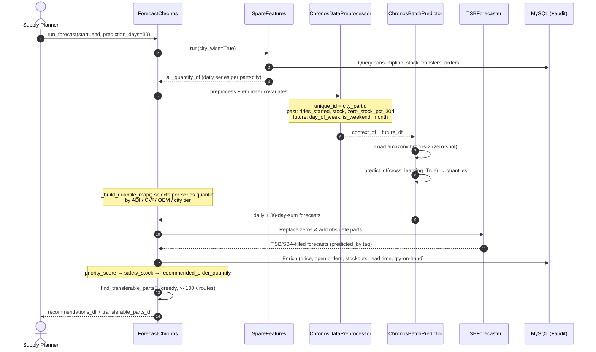
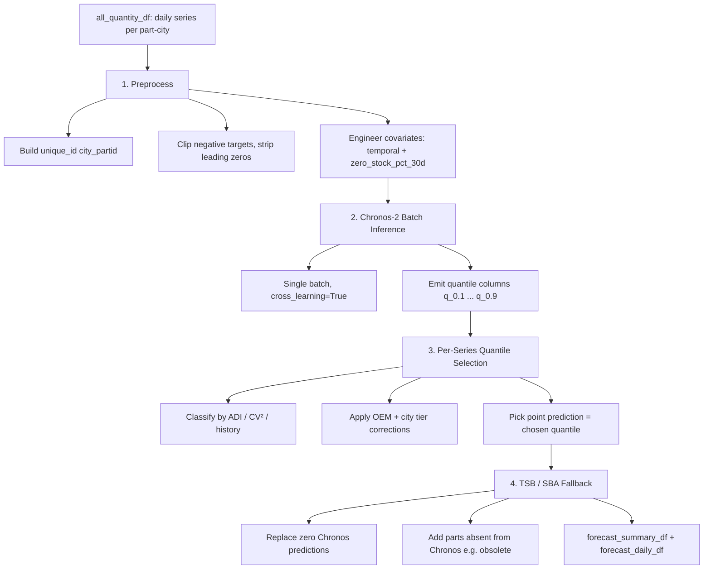

# Zypp Spare Parts Demand Forecaster — High-Level Processes and Flows

This document outlines the architecture, data flows, models, and key mechanisms of the **Zypp Spare Parts Demand Forecaster** (Chronos pipeline), Zypp Electric's AI system for predicting spare parts demand across cities and recommending purchase and inter-city transfer orders. It is structured to serve as a comprehensive prompt for generating slide decks, complete with visual suggestions and flowcharts.

---

## Brand Resources & Links
*   **Official Website:** [zypp.app](https://zypp.app)
*   **Brand Assets & Logos:** [Zypp Electric Logo & Brand Assets on Brandfetch](https://brandfetch.com/zypp.app)
*   **JIRA Epics:** ZYPPAI-109 (Chronos-2 Predictor), ZYPPAI-169 (Spare Features & Historical Backtesting)

---

## Slide 1: Executive Summary & Overview
**Visual Suggestion:** A modern, split-screen layout. On the left: A city map of India with stock-level heat indicators per warehouse. On the right: A time-series chart showing 250 days of historical consumption flowing into a 30-day forecast band, annotated with "Order" and "Transfer" call-outs.

*   **What is the Spare Parts Demand Forecaster?** A city-level, foundation-model time-series system that predicts spare parts demand for the next N days (default 30) and converts those forecasts into actionable procurement decisions.
*   **Core Capabilities:**
    *   **Demand Forecasting:** Predicts per-part, per-city consumption using Amazon's **Chronos-2** zero-shot foundation model with multivariate covariates.
    *   **Intermittent Demand Handling:** Falls back to **TSB / SBA** statistical methods for sparse, lumpy, or obsolete parts that Chronos under-serves.
    *   **Purchase Recommendations:** Computes priority scores, safety stock, and recommended order quantities net of stock-on-hand and open orders.
    *   **Inter-City Transfer Optimization:** Identifies surplus stock in one city that can satisfy demand in another, allocating greedily by transfer value.
*   **The Experience:** A fully automated, backtestable pipeline — point-in-time accurate via audit-table reconstruction — that turns raw consumption history into a ranked order book per city.

---

## Slide 2: Part / Demand Personas & Routing
**Visual Suggestion:** A matrix table or a set of card widgets, each representing a demand pattern with an ADI/CV² signature and the model that serves it.

To optimize forecast accuracy, every part-city series is classified by its demand pattern (via **ADI** — Average Demand Interval — and **CV²** — squared coefficient of variation) and routed to the model best suited for it.

| Demand Persona | Signature | Routed To | Notes |
| :--- | :--- | :--- | :--- |
| **Smooth / Frequent** | `ADI < 1.32`, low CV² | Chronos-2 (q≈0.54) | Reliable signal; long history → moderate buffer. |
| **Intermittent** | `1.32 ≤ ADI < 2.5` | Chronos-2, else **SBA** fallback | Regular but infrequent demand; SBA avoids TSB over-decay. |
| **Erratic / Lumpy** | `ADI ≥ 2.5`, high CV² | **TSB** | Probability decay suits sparse, spike-dominated demand. |
| **Cold-Start** | `< 60 days` active history | Chronos-2 (q=0.60) | No pattern signal yet → maximum quantile buffer. |
| **Obsolete / Retired** | Zero demand in last 60d, no restock | **TSB → forced 0** | Excluded from Chronos training; obsolescence gate returns 0. |

---

## Slide 3: Tech Stack & System Modules
**Visual Suggestion:** A layered architecture diagram showing the relationship between data sources, preprocessing, the model ensemble, and the recommendation engine.

```
       [ MySQL Operational + *_audit DBs (mobycyerp, mobycy) ]
                       │ (SQLAlchemy async)
       [ SpareFeatures — daily consumption per part_id × city ]
                       │
       [ ChronosDataPreprocessor ] ── (covariate engineering)
                       │
        ┌──────────────┴───────────────┐
  [ ChronosBatchPredictor ]      [ TSBForecaster ]
   (amazon/chronos-2, 120M)     (TSB / SBA fallback)
        │  cross-learning             │ intermittent + obsolete
        └──────────────┬──────────────┘
                       │
       [ ForecastChronos — recommendation engine ]
                       │ (priority scoring, safety stock, transfers)
       [ Redis Cache ] (end-of-day TTL on forecasts)
```

*   **Forecasting Core:**
    *   **Chronos-2 (`amazon/chronos-2`):** 120M-param, encoder-only, T5-inspired time-series foundation model. **Zero-shot — no training required.** Max context 8192, max horizon 1024. Supports univariate, multivariate, and past/future covariates.
    *   **Cross-Learning:** All series forecast in a single batch (`batch_size=-1`) so group attention shares signal across related part-city series — especially helpful for cold-start and short-history parts.
*   **Statistical Fallback:**
    *   **TSBForecaster:** Teunter-Syntetos-Babai method with built-in obsolescence handling via probability decay; routes to **SBA** (Syntetos-Boylan Approximation) for intermittent demand.
*   **Data & Feature Layer:**
    *   **SpareFeatures (ZYPPAI-169):** Builds the daily `stock_consumption_needed` series per part × city by merging fleet activity, stock ledgers, transfers, delivery and sales orders.
    *   **MySQL (SQLAlchemy):** Live operational tables plus `*_audit` tables for point-in-time historical reconstruction.
    *   **Redis:** Caches forecasts and features with an IST end-of-day TTL.
*   **Visualization:**
    *   **ChronosForecastPlotter (Plotly):** Forecast-vs-actual bar charts, scatter accuracy plots, and source-attribution (chronos/tsb) plots for validation.

---

## Slide 4: End-to-End Forecast Flow
**Visual Suggestion:** A horizontal sequence diagram tracking a forecast run from feature fetch to the final order book.



---

## Slide 5: Data Categorization (Series Signal vs. Enrichment)
**Visual Suggestion:** Two columns with distinct card colors. Left: "Time-Series Signal" (waveform icon). Right: "Point-in-Time Enrichment" (database grid icon).

The system segments data by its role in the pipeline:

| Data Type | Category | Source Systems | Update Frequency / Process |
| :--- | :--- | :--- | :--- |
| **Time-Series Signal** | Daily `stock_consumption_needed` per part × city, plus covariates: fleet `rides_started`, `end_of_day_stock`, `zero_stock_pct_30d`. | `SpareFeatures` over `mobycyerp` / `mobycy` (rides, stock, transfers, delivery & sales orders) | Built per run, cached in Redis to IST end-of-day. Feeds Chronos context (up to 250 days). |
| **Enrichment Data** | Part price & name, open PO pending qty, stockout events, order lead time, qty-on-hand, usage rate, days-of-cover. | Live tables + `*_audit` tables (`erp_purchase_order_audit`, `erp_warehouse_stock_audit`, `erp_delivery_order_audit`, `erp_orders_audit`, `erp_transfer_order_audit`) | Fetched per run; audit tables enable point-in-time backtesting at any `end_date`. |

---

## Slide 6: The Chronos-2 Forecasting Pipeline
**Visual Suggestion:** A flow diagram illustrating preprocessing → batch inference → per-series quantile selection → fallback.

To produce calibrated forecasts while controlling over/under-ordering, the predictor runs a four-stage pipeline:



### Pipeline Optimizations:
1.  **Zero-Shot, Cross-Learning Inference:** No model training. All part-city series share one batch so Chronos's group attention lifts cold-start and short-history accuracy.
2.  **Multivariate Covariates:** Past covariates (`rides_started`, `end_of_day_stock`, `zero_stock_pct_30d`) and known-future covariates (`day_of_week`, `is_weekend`, `month`) condition the forecast. `zero_stock_pct_30d` flags stockout suppression so Chronos doesn't under-predict once stock returns.
3.  **Per-Series Quantile Selection (`_build_quantile_map`):** Rather than a single global quantile, each series gets its own buffer based on demand frequency (ADI), variability (CV²), and history length — low-signal parts are systematically under-predicted by Chronos, so they receive a higher quantile.
4.  **OEM & City Tier Corrections:** Empirically-tuned per-OEM and per-city overrides (see Slide 7) correct systematic bias observed in monthly back-tests.
5.  **TSB / SBA Fallback:** Replaces Chronos zeros and covers obsolete parts absent from training, with ADI-based routing between TSB (lumpy) and SBA (intermittent).

---

## Slide 7: Per-Series Quantile Tiering & Bias Corrections
**Visual Suggestion:** A decision-tree infographic showing base tiers branching into OEM/city correction "patches," each annotated with the diagnostic that motivated it.

Because Chronos's raw median (q=0.50) systematically under- or over-predicts depending on demand shape, the system assigns each series a tuned quantile. Base tiers are **inverted** — weaker signal earns a higher buffer.

### Base Tiers (ADI threshold = 1.32)

| Condition | Quantile | Rationale |
| :--- | :--- | :--- |
| Frequent (`ADI < 1.32`), ≥150d history | **0.54** | Reliable signal, moderate buffer. |
| Frequent, 60–150d history | **0.56** | Shorter history → more buffer. |
| Intermittent (`ADI ≥ 1.32`), ≥150d | **0.56** | Intermittent demand → more buffer. |
| Intermittent, 60–150d | **0.60** | Worst coverage → maximum buffer. |
| Cold-start (`< 60d` active) | **0.60** | No pattern signal → maximum buffer. |

### Corrections (applied in order)
*   **Near-obsolete:** declining last-90d demand → cap at `q=0.54` (don't over-order an exiting part).
*   **Demand ramp** (smooth only): low-volume part ramping ≥1.5× → `q=0.70` (Chronos trained on low early demand).
*   **Demand lull:** consumption collapsed <35% of historical → `q=0.70` (hedge against stockout-suppressed recovery).
*   **Fix B — Intermittent + High-CV² cap:** `ADI 1.32–2.5`, CV² ≥ 1.0 → cap `q=0.50`.
*   **Fix D — HYD short-history cap:** Hyderabad parts with 60–120d history → cap `q=0.50`.

### OEM / City Overrides (applied last)

| Override | Effect | Diagnostic Basis |
| :--- | :--- | :--- |
| **Fix E/H — Kinetic** | Hard cap `q=0.30` | Recently-onboarded Kinetic Green; spike-dominated history overshoots across all tiers. |
| **Fix K — e-sprinto** | Floor `q=0.70` | Higher-demand service parts; natural tier massively under-predicts (−₹509K). |
| **Fix L — Odysse intermittent** | Floor `q=0.70` | `ADI ≥ 1.32` odysse under-predicts (−₹353K); smooth odysse left alone. |
| **Fix M — Common OEM** | Floor `q=0.60` | Common smooth parts under-predict (58% of rows) at base tier. |
| **Fix C — MUM city boost** | `q += 0.04` (≤0.70), stable parts only | Mumbai's systematic under-prediction holds for high-frequency, long-history parts. |

> These corrections encode months of back-test learning; each is gated narrowly (by OEM, city, ADI, CV², and history length) to avoid collateral over-correction.

---

## Slide 8: Recommendation & Transfer Logic
**Visual Suggestion:** A two-panel diagram. Top: a single part's journey from forecast → priority boost → safety stock → order qty. Bottom: a city-to-city flow map showing surplus routed to demand.

Once the demand forecast exists, `ForecastChronos` converts it into an actionable order book.

### Priority Scoring (city-wise percentile ranking)

```python
priority_score = (
    usage_percentile        * 0.35 +   # high-usage parts matter more
    hard_stockout_percentile * 0.30 +   # actual zero-stock = critical
    soft_stockout_percentile * 0.15 +   # running low = warning
    cv_percentile           * 0.20     # unpredictable demand needs buffer
)
boost_factor = 1.0 + (priority_score * 0.20)   # range 1.00–1.20
```

### Order Quantity

```python
D_lead       = sum(daily_predictions[:lead_time_days])           # lead-time demand
safety_stock = critical_low_rate * D_lead + (cv * D_lead * 0.2)  # soft-stockout + variability
base_qty     = max(0, prediction + safety_stock - current_actual_qty)
recommended_order_quantity = round(base_qty * boost_factor)
```

*   `current_actual_qty` nets warehouse stock + open POs + incoming transfers − sales-order pending − outgoing transfers.

### Inter-City Transfer Allocation (`find_transferable_parts`)

```
1. SURPLUS cities:  surplus_qty = current_qty − (recommended_qty × 1.5)   (keep > 0)
2. DEMAND cities:   recommended_order_quantity > 0
3. Match same part_id across different cities
4. Greedy allocation: process source cities by total transfer value (high → low),
   deduct surplus/demand as allocated
5. Keep only routes where total_transfer_value > ₹100,000
```

| Config Parameter | Default | Description |
| :--- | :--- | :--- |
| `prediction_days` | 30 | Forecast horizon. |
| `context_length` | 250 | Days of history fed to Chronos. |
| `min_transfer_cost_threshold` | ₹100,000 | Minimum value for a valid transfer route. |
| `transfer_order_stock_buffer_multiplier` | 1.5 | Surplus threshold multiplier. |
| `critical_days_threshold` | 5 | Days-of-cover below which stock is "critical". |

---

## Slide 9: Validation, Backtesting & Deployment Checklist
**Visual Suggestion:** A checklist slide with metric badges (RMSE, MAE, MAPE, SMAPE, bias) and a backtesting timeline.

*   **Audit-Table Backtesting (`ForecastChronosHistory`, ZYPPAI-169):** Reconstructs purchase orders, stock levels, deliveries, and pending sales as they existed at any historical `end_date`, enabling honest point-in-time validation rather than leaking current snapshots.
*   **Validation Metrics:** `run()` performs a time-based train/test split (cutoff = `max_date − prediction_length`) and reports **RMSE, MAE, MAPE, SMAPE, under-prediction %, and mean bias**, overall and by demand category.
*   **Per-Series Diagnostics:** Each forecast row carries `quantile_used`, `history_days`, `adi`, `cv2`, and full `quantile_values`, so over/under-ordering can be traced to the exact tier or correction that produced it.
*   **Source Attribution:** Every prediction is tagged `predicted_by = chronos | tsb`, making it auditable which engine produced each number.
*   **Compute Footprint:** Chronos-2 loads in float32 and resolves device automatically (CUDA if available, else CPU); cross-learning inference runs all series in one batch.
*   **Caching:** Forecasts and features are Redis-cached with an IST end-of-day TTL to avoid recomputation within a day.
*   **Component Self-Tests:** `eval()` methods on the preprocessor, batch predictor, and TSB forecaster validate imports, covariate handling, and both TSB/SBA paths as a release gate.
