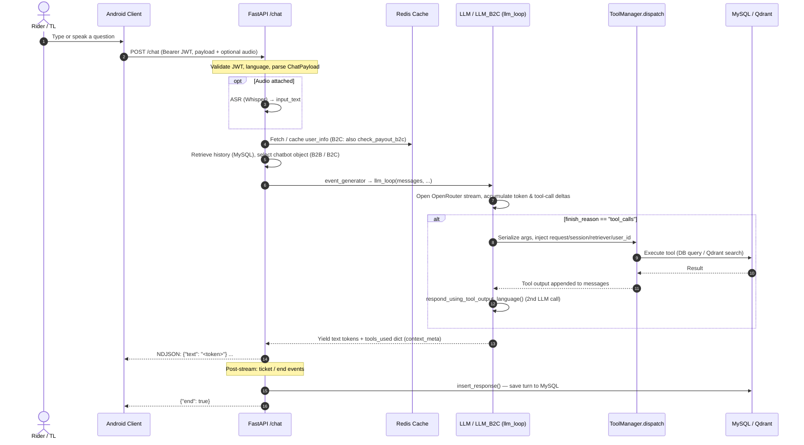
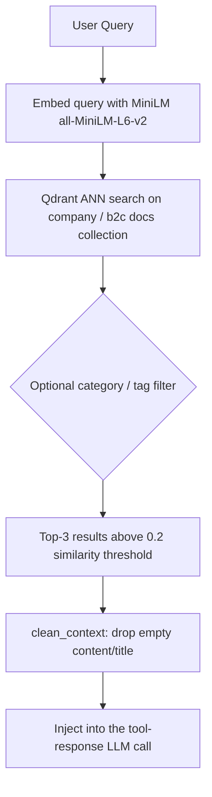

# Zia Chatbot — High-Level Processes and Flows

This document outlines the architecture, data flows, APIs, and key mechanisms of **Zia**, Zypp Electric's AI chatbot assistant for delivery riders (B2C) and internal Team Leaders (B2B). It is structured to serve as a comprehensive prompt for generating slide decks, complete with visual suggestions and flowcharts.

> **Release status:** This document describes **Phase 2.0**, the version currently **live in production**. **Phase 3.0** (built, in final testing, **not yet live**) is summarised as an ongoing roadmap on the final slide.

---

## Brand Resources & Links
*   **Official Website:** [zypp.app](https://zypp.app)
*   **Brand Assets & Logos:** [Zypp Electric Logo & Brand Assets on Brandfetch](https://brandfetch.com/zypp.app)

---

## Slide 1: Executive Summary & Overview
**Visual Suggestion:** A modern, split-screen layout. On the left: A smartphone showing a text + voice chat bubble UI with Zia. On the right: A schematic showing a question flowing into the LLM → tool dispatch → live database → natural-language answer.

*   **What is Zia?** A real-time, multilingual AI chatbot embedded in the Zypp Android app, serving two distinct audiences from a single backend: delivery riders (B2C) and internal Team Leaders (B2B).
*   **Core Capabilities (Phase 2.0 — Live):**
    *   **Earnings & Wallet Insights:** Payout summaries, incentive/deduction bifurcation, wallet transactions, rent deductions, rate cards, and security deposit status.
    *   **Support & Ticketing:** Raises payout / vehicle / Zypp Suraksha tickets directly from the conversation, with duplicate-ticket detection.
    *   **Knowledge Base Q&A:** Answers company policies, FAQs, and org-structure questions via semantic search (RAG) over Zypp documents.
    *   **Profile & Vehicle Info:** Rider profile lookup, past rides, city-wise hub listings, and Zypp vehicle offerings.
*   **The Experience:** Streaming, token-by-token text responses (optionally with synchronized TTS audio), and hands-free voice input via Whisper ASR — in Hindi, English, and major regional languages.

---

## Slide 2: User Roles & Capabilities
**Visual Suggestion:** A matrix table or three card widgets, each representing a distinct persona with icons and a permitted-tool checklist.

A single boolean (`b2c`) on every request routes the user into a completely different tool set, system prompt, and inference object — resolved once per request.

| Persona / Role | Key Description | Permitted Tools & Lookups |
| :--- | :--- | :--- |
| **B2B (Team Leader)** | riders connected to zomato, blinkit etc and riding zypp vehicle  | Group payout/wallet/rent details, incentive-deduction bifurcation, rate card, security deposit, wallet transactions, tickets, vehicle offerings, city-wise hubs, knowledge base, past rides, user info. |
| **B2C(not connected to any client ) — With Payout** | Riders with a payout in the last 3 months. | Wallet, rent, rate card, security deposit, tickets, TL contact, knowledge base, user info, past rides, **plus** payout summary and incentive/deduction bifurcation tools. |
| **B2C(not connected to any client) — Without Payout** | Newer riders with no recent payout. | Same B2C base tools, but payout tools are replaced with a single combined `get_wallet_or_rent` tool — payout tools are never exposed to avoid confusion. |

*   **Role Resolution:** The `b2c` flag selects between two pre-built inference objects (`LLM` for B2B, `LLM_B2C` for B2C). For B2C, `check_payout_b2c()` further decides which tool schemas are exposed to the model.

---

## Slide 3: Tech Stack & System Modules
**Visual Suggestion:** A layered architecture diagram showing the relationship between clients, the FastAPI gateway, the custom inference loop, and the databases.

```
            [ Android / Web Client ]
                       │  POST /chat (multipart: JSON payload + optional WAV)
                       │  Authorization: Bearer <jwt_token>
            [ FastAPI Router — api.py ]
                       │
        ┌──────────────┼───────────────┐
        │              │               │
 [ ASR: Whisper ]      │       [ TTS: OpenAI TTS ]
        │              ▼               │
        │   [ LLM / LLM_B2C class — llm_loop() ]
        │     (OpenRouter via openai.AsyncOpenAI)
        │              │
        │   [ ToolManager / B2CToolManager.dispatch() ]
        │       /                \
        │  [ MySQL (SQLAlchemy) ]  [ Qdrant + MiniLM ]
        ▼              │                │
 [ event_generator ]   │         [ Knowledge Base ]
        │       [ Redis (user_info cache) ]
        ▼
   NDJSON stream back to client
```

*   **Web Framework:** **FastAPI** — async-native, Pydantic validation, streaming responses, per-endpoint rate limiting via **slowapi**.
*   **LLM Provider/Model:** **OpenRouter** serving `meta-llama/llama-4-scout-17b-16e-instruct`, called directly through **`openai.AsyncOpenAI`** with a `base_url` override.
*   **Inference Engine:** A custom **`LLM` / `LLM_B2C` class** with a hand-rolled streaming `llm_loop()` that manages the LLM → tool-call → LLM-response cycle.
*   **Tool Layer:** **`ToolManager` / `B2CToolManager`** glue Python tool functions to manually-written **JSON schema files** and dispatch calls at runtime.
*   **Vector Engine:** **Qdrant** stores Zypp company docs; **MiniLM (`all-MiniLM-L6-v2`, 384-dim)** encodes queries and documents.
*   **Operational Layer:** **MySQL** (async SQLAlchemy) for rides, payouts, wallets, tickets; **Redis** caches expensive user lookups.
*   **Voice:** **OpenAI Whisper** (remote ASR) with Silero VAD + high-pass filtering for input; **OpenAI TTS** for streamed PCM audio output.

---

## Slide 4: End-to-End User Flow
**Visual Suggestion:** A horizontal sequence diagram tracking a chat message from the Android app to the streamed response.



---

## Slide 5: Data Categorization (Live vs. Static)
**Visual Suggestion:** Two columns with distinct card colors. Left: "Static Knowledge Base" (vector DB icon). Right: "Live Operational Data" (database grid icon).

The system segments data based on latency and mutability requirements:

| Data Type | Category | Source Systems | Update Frequency / Process |
| :--- | :--- | :--- | :--- |
| **Static Data** | Company policies, FAQs, org structure, named individuals, vehicle/onboarding info. | Documents embedded into **Qdrant** | Ingested ahead of time via the `data_ingestion` upsert pipelines (company + B2C), chunked and embedded with MiniLM. |
| **Live Data** | Rider profile, daily payouts, wallet balance & transaction ledger, rent slabs, rate cards, tickets, past rides. | **MySQL** operational DBs (`rides`, `users`, `mobycypayout`, `mobycy`) | Fetched in real time during the call via tool functions using SQLAlchemy query builders in `pipelines/tools/queries/`. |
| **Cached Data** | Pre-formatted `user_info` profile string injected into every system prompt. | **Redis** (over MySQL) | Cached with `CACHE_TIME_LARGE` TTL; `/new-session` warms the cache so the first `/chat` is fast. |

---

## Slide 6: Tool System Architecture (Phase 2.0)
**Visual Suggestion:** A two-panel diagram — left: the dual-source registration (Python function + JSON schema); right: the dispatch-time dependency injection.

In the live system, every tool is defined in **two synchronized places**, glued together by a tool manager at startup.

*   **Dual Source of Truth:**
    *   **Python function** — e.g. `pipelines/tools/llm_tools/payout_tools.py`, accepting `request`, `session`, `retriever`, `user_id` plus the LLM-supplied business args.
    *   **JSON schema file** — e.g. `pipelines/tools/llm_tools/schemas/payout_tools.json`, manually describing those parameters for the OpenAI tool-calling API.
*   **`ToolManager` (B2B) / `B2CToolManager` (B2C):**
    *   At startup, reads every `.json` in the schemas directory, `importlib.import_module`s the matching module, verifies the function exists, and registers both.
    *   `dispatch()` `json.loads` the LLM-provided argument string and injects `request`, `session`, `retriever`, `user_id` server-side before calling the function.
    *   `B2CToolManager.get_tool_schemas()` deep-copies the schema list **per request** and filters it based on the `check_payout_b2c()` result — exposing or hiding payout tools.
*   **Security Invariant:** `request`, `session`, `retriever`, and `user_id` are injected at dispatch time and are **never** part of the LLM-facing JSON schema — the model cannot supply or hijack them.

---

## Slide 7: Knowledge Base RAG Pipeline
**Visual Suggestion:** A simple linear flow diagram from query to ranked, filtered context.

The `search_zypp_knowledge_base` tool provides semantic search over Zypp company documents for policy, FAQ, and org-structure questions.



*   **Two Separate Retrievers:** `b2b_retriever` and `b2c_retriever` are initialized independently at startup, allowing different Qdrant collections/configs per audience.
*   **Local Embedding:** MiniLM runs locally for fast, low-cost query encoding (no per-query embedding API cost).
*   **Ingestion:** `pipelines/data_ingestion/` holds separate upsert pipelines for company docs and B2C content, embedding and writing into Qdrant ahead of query time.

---

## Slide 8: Real-Time Voice & Streaming Pipeline
**Visual Suggestion:** An infographic highlighting four engineering stages: microphone (ASR), inference loop, speaker (TTS), and a streaming arrow.

*   **ASR Pipeline (`ASRProcessorRemote`):** WAV bytes → high-pass Butterworth filter (80 Hz) → silence trimming → Silero VAD energy/confidence check → Whisper transcription. Silent/noise-only input short-circuits to `{"blank_flag": true}` without ever calling Whisper. Supports Hindi, Kannada, Marathi, Tamil, and English.
*   **Streaming Inference (`llm_loop` + `event_generator`):** The custom loop opens an OpenRouter stream, accumulates tool-call argument fragments across chunks into a `pending_calls` dict, dispatches tools on `finish_reason == "tool_calls"`, then runs a second LLM call to wrap results in natural language. `event_generator_openai` / `event_generator_b2c` wrap this in `buffered_stream_chunks()` and emit NDJSON lines.
*   **Metadata Side-Channel:** Tool-usage metadata (`context_meta`) is yielded back through the same generator as a Python `dict` and detected with an `isinstance(chunk, dict)` check, separating it from text tokens before emitting ticket/end events.
*   **Dual-Phase TTS (`AsyncOpenAITTS`):** When `output_audio=True`, text tokens stream to the client as they arrive; once the full response is collected, cleaned text (markdown stripped, numbers spelled out) is sent to OpenAI TTS and PCM audio is streamed back in the same payload.

---

## Slide 9: Core APIs & Lifecycle
**Visual Suggestion:** A neat endpoint list with icons plus a startup-lifecycle timeline.

**Core Endpoints (`/chatbot_api` prefix):**

| Endpoint | Purpose |
| :--- | :--- |
| `POST /chat` | Primary streaming chat endpoint (text or audio in, NDJSON stream out). Rate limited to 200 req/min. |
| `POST /new-session` | Resumes a same-day session or starts a new one with a greeting + welcome audio; warms the Redis cache. |
| `GET /suggested-messages` | Returns a static, predefined set of follow-up question chips based on user type. |
| `POST /chat-feedback` | Stores rider feedback text + a 1–5 rating. |
| `POST /chat-enabled` | Feature-flag check for the Android client. |
| `POST /new-chat-audio` | Returns base64 welcome audio. |

**Startup Lifespan:** The two inference objects (`app.state.chatbot` for B2B, `app.state.chatbot_b2c` for B2C) plus the Qdrant retrievers, TTS, and ASR clients are constructed **once** at app startup and attached to `app.state` — initialization is expensive, reuse is free. The correct object is selected per request from the `b2c` flag.

---

## Slide 10: Tech Stack Summary & Deployment Checklist
**Visual Suggestion:** A neat checklist slide with logos/icons of the technology components.

*   **Inference:** OpenRouter (`meta-llama/llama-4-scout-17b-16e-instruct`) via `openai.AsyncOpenAI`, driven by the custom `LLM` / `LLM_B2C` streaming loop.
*   **Vector DB:** Qdrant collections populated by the `data_ingestion` upsert pipelines before first query; MiniLM embeddings run locally.
*   **Operational DB:** MySQL (async SQLAlchemy) for rides, payouts, wallets, tickets, rate slabs — queried via raw SQL builders in `pipelines/tools/queries/`.
*   **Cache:** Redis for `user_info` and B2C payout-status caching.
*   **Voice:** OpenAI Whisper (ASR) and OpenAI TTS, configured via `OPENAI_API_KEY`.
*   **Config:** `LLM_API_KEY` / `LLM_BASE_URL` (OpenRouter), `QDRANT_URL` / `QDRANT_API_KEY`, `REDIS_URL`, `SECRET_KEY` (JWT) — all loaded from `.env`.

---

## Slide 11: Phase 3.0 — Ongoing (Built, Not Yet Live)
**Visual Suggestion:** A horizontal roadmap timeline with a "Phase 2.0 — Live" marker on the left and a highlighted "Phase 3.0 — In Final Testing" block on the right containing the items below.

Phase 3.0 is **complete and in final testing**, scheduled to replace the live Phase 2.0 build. It focuses on the following workstreams:

*   **LangChain / LangGraph Migration:** Re-platforming the inference engine from the hand-rolled `llm_loop` and `ToolManager` onto a LangGraph state-machine with `@tool`-decorated functions as a single tool source.
*   **Contextual Suggestions:** Upgrading `/suggested-messages` from a static list to context-aware follow-up questions driven by the last tool used and an intent classifier.
*   **Deeplink Redirection:** Returning Android deeplinks alongside responses so the app can auto-navigate to the relevant screen (wallet, support, rate card, etc.).
*   **Navigation:** GPS-aware "nearest hub" and "nearest battery swapping point" guidance using rider coordinates and vehicle-type compatibility.
*   **Bad-Rating Review:** A batch of feedback-driven UX fixes targeting the highest-volume bad-rating patterns (wallet/rent decode, guided flows, clarification fallback, repeat-issue escalation, voice-noise recovery, and more).
*   **Performance Enhancement:** Latency and cost optimizations across the inference, retrieval, and caching paths.
*   **Single Source for Zia & Zypp Saathi:** Consolidating shared logic so the Zia chatbot and the Zypp Saathi voice assistant draw from one common codebase.
