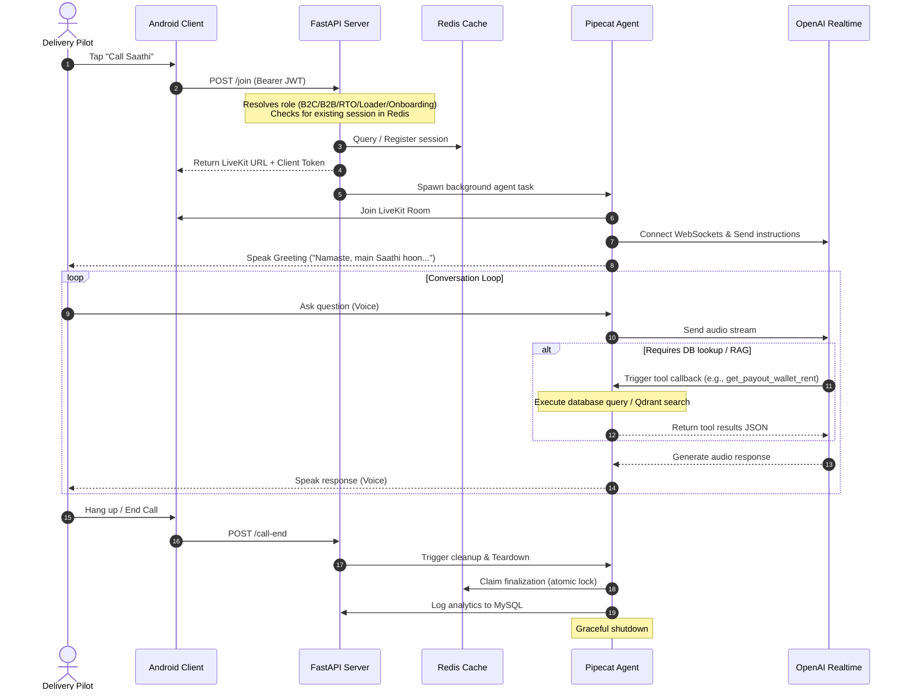
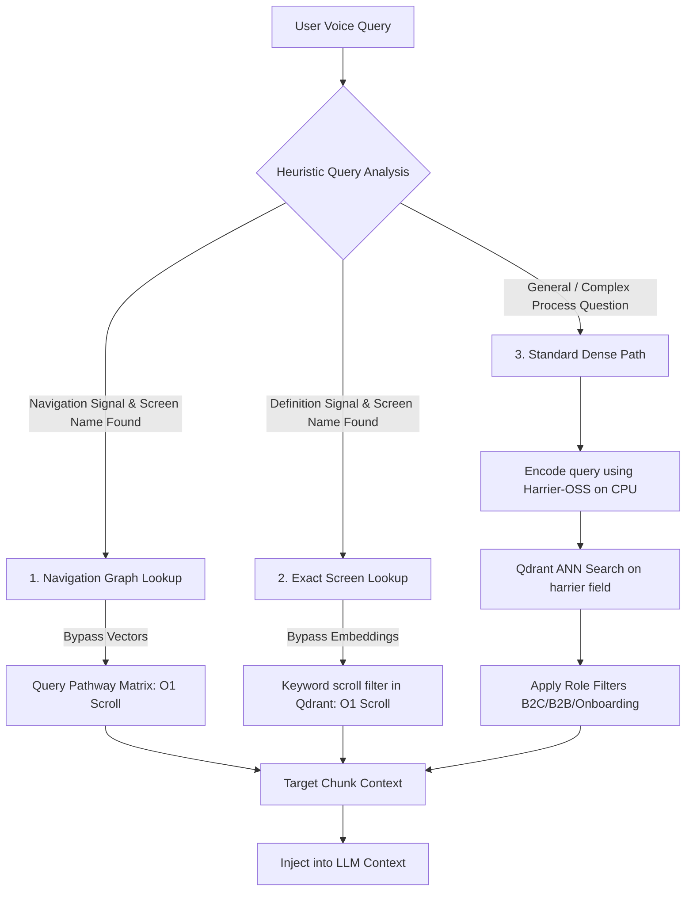

# Zypp Saathi — High-Level Processes and Flows

This document outlines the architecture, data flows, APIs, and key mechanisms of **Zypp Saathi**, Zypp Electric's AI voice assistant for delivery riders (pilots). It is structured to serve as a comprehensive prompt for generating slide decks, complete with visual suggestions and flowcharts.

---

## Brand Resources & Links
*   **Official Website:** [zypp.app](https://zypp.app)
*   **Brand Assets & Logos:** [Zypp Electric Logo & Brand Assets on Brandfetch](https://brandfetch.com/zypp.app)

---

## Slide 1: Executive Summary & Overview
**Visual Suggestion:** A modern, split-screen layout. On the left: A smartphone showcasing a "Call Saathi" voice interface. On the right: A high-level schematic showing voice inputs converting into live database queries and policy lookups.

*   **What is Zypp Saathi?** A real-time, multilingual AI voice assistant integrated into the Zypp Android app for delivery riders.
*   **Core Capabilities:**
    *   **Rider Onboarding Journey:** Assisting prospective riders with registration, KYC documents, and onboarding checklist navigation.
    *   **App Navigation:** Guiding riders on how to use the app and explaining different screen layouts.
    *   **Earnings & Vehicle Info:** Providing real-time checks on wallet balances, payment transactions, rental rates, and security deposits.
    *   **Vehicle Support & Human Escalation:** Directing riders to battery swap hubs, troubleshooting vehicle operational policies, and seamlessly creating support tickets to connect with human support.
*   **The Experience:** High-speed, low-latency, hands-free conversation with barge-in support and active, personalized context.

---

## Slide 2: User Roles & Capabilities
**Visual Suggestion:** A matrix table or a set of five card widgets, each representing a distinct rider persona with icons and checklist permissions.

To optimize safety and response accuracy, the assistant resolves the rider's role dynamically and registers only the tools permitted for that role.

| Persona / Role | Key Description | Permitted Tools & Lookups |
| :--- | :--- | :--- |
| **B2C (Consumer)** | Standard delivery pilots renting vehicles. | Payouts, Wallet Balance/History, Vehicle Rent, Active Rate Card, Security Deposit schedule, Policy RAG, Support Tickets. |
| **B2B (Business)** | Pilots assigned to corporate clients. | Wallet Balance/History, Vehicle Rent, Active Rate Card, Security Deposit schedule, Policy RAG, Support Tickets. *(Note: Payout info is blocked and refused for B2B pilots)*. |
| **RTO (Rent-to-Own)** | Pilots on a path to vehicle ownership. | B2C Financial Tools + RTO EMI deduction schedule and completion dates. |
| **Loader (Cargo/3W)** | Pilots operating 3-wheeler cargo vehicles. | Financial Tools adjusted for 3-wheeler slab rate cards and fleet constants. |
| **Onboarding** | Prospective pilots in the KYC pipeline. | Onboarding RAG & KYC policies, Support Tickets. *(Blocked from accessing any financial or active ride tools)*. |

---

## Slide 3: Tech Stack & System Modules
**Visual Suggestion:** A layered architecture diagram showing the relationship between clients, voice pipelines, NLP, and databases.

```
       [ Android Client App (LiveKit SDK) ]
                       │ (WebRTC SFU)
       [ FastAPI Gateway / Join Router ]
                       │
             [ Pipecat Framework ] ── (Redis Session Store)
              /                 \
  [ OpenAI Realtime API ]   [ Harrier Reranker (CPU) ]
   (gpt-realtime-2 voice)            │ (Dense Vectors)
              │               [ Qdrant Vector DB ]
       [ MySQL Databases ] (Operational Read/Write)
```

*   **Voice Pipeline & Transport:** 
    *   **Pipecat Orchestrator (v1.2.0):** Manages real-time audio streams, LLM events, and tools.
    *   **LiveKit (WebRTC SFU):** Handles low-latency audio input/output, replacing raw WebSockets.
*   **LLM & Speech Engines:**
    *   **OpenAI Realtime API (`gpt-realtime-2`):** Combines VAD, Speech-to-Text (Whisper), LLM, and Text-to-Speech into a single WebSocket connection.
*   **Vector Engine & NLP:**
    *   **Qdrant Vector DB:** Stores knowledge base embeddings.
    *   **Harrier-OSS (`microsoft/harrier-oss-v1-270m`):** Local CPU-based embedding model (~100ms inference) used for query vector encoding.
*   **Operational Layer:**
    *   **FastAPI:** Exposes room join and teardown endpoints.
    *   **Redis:** Manages session locking, grace rejoin windows, and state synchronization.
    *   **MySQL (SQLAlchemy):** Queries active payouts, rent slabs, KYC, and tickets.

---

## Slide 4: End-to-End User Flow
**Visual Suggestion:** A horizontal sequence diagram tracking a call from initiation to wrap-up.



---

## Slide 5: Data Categorization (Live vs. Static)
**Visual Suggestion:** Two columns with distinct card colors. Left: "Static Knowledge Base" (Google Drive sync icon). Right: "Live Operational Data" (Database grid icon).

The system segments data based on latency and mutability requirements:

| Data Type | Category | Source Systems | Update Frequency / Process |
| :--- | :--- | :--- | :--- |
| **Static Data** | Onboarding rules, KYC checklists, navigation menus, battery swap center locations, company policies, FAQs. | Google Drive (Google Sheets/Docs) | Synced via a background task (`cron.py`). Chunked, embedded locally on CPU using Harrier-OSS, and upserted to Qdrant. |
| **Live Data** | Pilot profile context, daily payouts, current wallet balance, transaction ledger, active rental slabs, support tickets. | MySQL Operational DBs (`rides`, `users`, `mobycypayout`, `mobycy`) | Fetched in real time during the call via database tools using SQLAlchemy query builders. |

---

## Slide 6: High-Accuracy RAG Pipeline
**Visual Suggestion:** A flow diagram illustrating the metadata-first routing decision tree.

To achieve sub-300ms retrieval and eliminate LLM hallucinations, the retriever implements a three-tier routing strategy:



### Retrieval Optimizations:
1.  **Linguistic Heuristics:** Classifies queries automatically into `navigation`, `definition`, or `process`.
2.  **Navigation Graph:** Uses matrix maps in documents to immediately retrieve adjacent screens (e.g., "what comes after bank verification").
3.  **Fuzzy Screen Extraction:** Resolves screen names even if the pilot names them verbosely.
4.  **Local Bi-Encoder:** Harrier-OSS v1 uses query-task instruction tuning to query-match passages with high Indic language comprehension.
5.  **Role-Based Metadata Scoping (via `tool_registry.py`):** Prevents cross-role confusion (e.g., B2B pilots seeing B2C payout instructions) by applying Qdrant pre-filters during vector lookup:
    *   **`flow_type` Filter:** Queries are strictly isolated by role (`b2c`, `b2b`, `rto`, `l3`, or `common`). Active pilots' queries automatically inject their resolved role, whereas onboarding users can explicitly query flow paths (`rto`, `b2c`, `l3`).
    *   **`doc_type` Filter (Grouped in `COARSE_DOC_TYPE_MAP`):** Scopes the vector search space based on user lifecycle. Onboarding pilots can only search onboarding/KYC documents, while active pilots search payment, vehicle ops, and safety docs (onboarding checklists are excluded).
    *   **`source_sheet` Filter:** Restricts lookup to specific source spreadsheet tabs (e.g., `rto_reg_flow`, `app_navigation_doc`, `other_info`) when the LLM triggers a filtered search query.

---

## Slide 7: Real-Time Voice Optimizations & Safety
**Visual Suggestion:** An infographic highlighting four key engineering guardrails with security and stability shields.

To prevent typical issues associated with voice pipelines (such as background noise, accidental interruptions, and prompt injections), the system implements several optimizations:

*   **Ambient Noise Filtering (`_FilteredRealtimeLLM`):** Overrides OpenAI's audio transcription event. If ambient sounds or breath trigger the VAD but the Whisper transcript returns empty, the agent cancels the response before any audio output is sent to the client.
*   **Barge-in Shielding (`asyncio.shield`):** When a user interrupts the agent (barge-in), Pipecat interrupts the audio. However, the executing database tools are wrapped in an `asyncio.shield` task, preventing queries or ticket creation writes from corrupting or failing mid-execution. A 5-second grace window is granted to collect results.
*   **Indic Language VAD Tuning:** Uses server-side VAD with `silence_duration_ms=900` and `threshold=0.72`. Standard configurations often close turns too early on Indic languages, cutting off tail words.
*   **Pilot ID Security Invariant:** The database tools require `pilot_id` and `call_id`. These are injected server-side by the API wrapper. They are **never** declared as LLM-visible parameters, preventing prompt injection attacks from hijacking other pilots' data.

---

## Slide 8: Core APIs & Lifecycles
**Visual Suggestion:** A lifecycle timeline diagram showing state transitions: `PENDING` -> `ACTIVE` -> `DISCONNECT_PENDING` -> `FINALIZED`.

The system exposes three high-level endpoints:

1.  **Session Join Endpoint (`POST /join`)**
    *   Authenticates riders, resolves dynamic roles, and checks for session resume within a 20-second grace window.
    *   Generates connection credentials and initializes the LiveKit background agent.
2.  **Session Terminate Endpoint (`POST /call-end`)**
    *   Triggered explicitly by the client app upon hang-up.
    *   Finalizes call metadata, logs turn analytics, and saves/closes active support tickets.
3.  **Connectivity Health Endpoint (`GET /health`)**
    *   Monitors connectivity states across all core database and vector search engines.

---

## Slide 9: Tech Stack Summary & Deployment Checklist
**Visual Suggestion:** A neat checklist slide with logos/icons of the technology components.

*   **Production Hardware/CPU:** Core embedding (Harrier-OSS) runs locally on CPU (~550MB model footprint), saving API costs.
*   **Session Store:** Redis manages the transient session states and atomic finalization locks (`claim_finalization`).
*   **RAG Synchronization:** Google Drive document sync runs via background APScheduler sync pipelines.
*   **Operational DB:** Highly normalized MySQL schemas containing ledger data, rate cards, and ticketing profiles are queried directly using SQLAlchemy async sessions.
*   **Test Pipeline:** Standalone test framework (`test_pipeline.py`) validates imports, database queries, and live LLM connections, establishing a reliable gateway check for release cycles.
